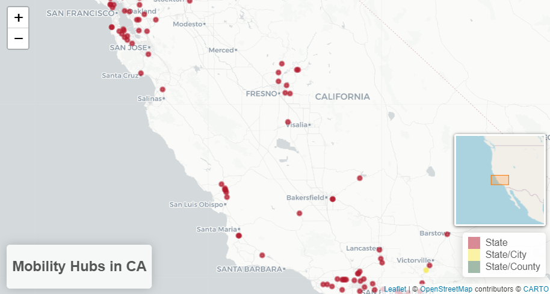

# Mobility Hubs in California - Analysis and Visualization

This project explores and visualizes the distribution of mobility hubs in California, focusing on facilities like parking lots, bike lockers, and EV chargers. I included interactive mapping and spatial analysis using cartograms to highlight areas with higher concentrations of mobility hubs.

## Data Source

The dataset for this project comes from the [California Department of Transportation Park and Ride Facilities](https://catalog.data.gov/dataset/park-and-ride-364a9). It contains information about the locations, ownership, and available facilities at park-and-ride sites across California.

## Objective

1. Visualize the spatial distribution of mobility hubs in California.
2. Highlight mobility hubs owned by `State`, `State/City`, and `State/County`.
3. Use interactive maps to explore individual hub details.
4. Create a cartogram to emphasize regions with high concentrations of mobility hubs.

## Tools and Libraries Used

- Programming Language: R
- Libraries: ggplot2, sf, dplyr, tidyverse, leaflet, cartogram, RColorBrewer, plotly, htmlwidgets

## Steps and Methods

### Data Preprocessing
- Removed irrelevant columns and renamed the dataset columns for clarity.
- Filtered data to include only mobility hubs with valid latitude and longitude coordinates.
- Focused on hubs owned by `State`, `State/City`, and `State/County`.

### Interactive Map (Leaflet)
- Visualized the locations of mobility hubs using Leaflet.
- Added color coding for ownership types and interactive popups for detailed information.
- Included a mini-map for better navigation.

The interactive map is saved as `m.html` in the project directory. You can open it in a browser to view and interact with the map.

### Cartogram
- Aggregated the mobility hub data at the county level.
- Merged spatial data with hub count information.
- Used a continuous cartogram to distort county shapes based on the number of mobility hubs.
- Applied a gradient color scheme to highlight the density of hubs.

 

## Results and Interpretations

### Interactive Map
- Provides a geographically accurate view of mobility hub locations.
- Distinguishes ownership types through color coding.
- Enables exploration of detailed hub information through popups.

### Cartogram
- Highlights areas with the highest density of mobility hubs (e.g., metropolitan areas).
- Uses distortion and color to emphasize patterns, making it easier to identify regions with high and low mobility hub counts.

## Visualization Examples

### Leaflet Map
The interactive map is available in the `m.html` file. Open it in your browser to explore!

### Cartogram
The cartogram visually distorts county shapes to emphasize the number of mobility hubs in each region.

Results and Interpretations
Interactive Map
I created an interactive map using Leaflet to show the geographical distribution of mobility hubs in California. The map provides geographical accuracy and clearly displays the locations of mobility hubs across counties. I used different colors to distinguish between ownership types (State, State/City, and State/County), making it easy to identify the managing entity of each hub. By interacting with the map, I could zoom in, zoom out, and click on specific locations to access detailed information about each hub. This enhanced the exploratory nature of the analysis and allowed for a better understanding of spatial relationships.

Cartogram
I created a cartogram to visualize the concentration of mobility hubs by distorting county shapes based on the number of hubs. Regions with more hubs are emphasized through larger distortions and darker colors, while regions with fewer hubs are de-emphasized. By using this distortion technique, I was able to quickly identify patterns, such as the counties with the highest densities of mobility hubs. The cartogram made it easier to focus on these regions, especially when combined with a gradient color scheme. However, I observed that while the cartogram effectively highlights hub density, it does not convey additional hub-specific information. Depending on the intended use, the cartogram and interactive map complement each other by providing both high-level patterns and detailed insights.
